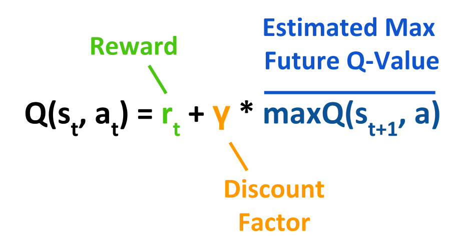

# Minesweeper using Deep Q-Learning Networks - Reinforcement Learning

## Table of Contents
1. [Introduction to Minesweeper](#intro)
2. [Usage guideline](#guideline)
2. [Deep Q-Learning Networks](#DQN)
<!-- 
<video width="320" height="320" controls>
  <source src="assets/Demo.webm" type="video/mp4">
</video> -->


## Introduction: The Game of Minesweeper <a name='intro'></a>

Minesweeper is a classic game of logic, dating back to 1989. The objective - click on all tiles except the ones containing mines. By clicking on tiles you reveal numbers which indicate how many mines are in the tiles around them. You progress through the game by revealing numbers and deducing where it is safe to click next.

The reward model in this RL scenario assigns specific values to different outcomes. When the player loses, the reward is -1, indicating a negative outcome. Making progress in the game is rewarded with a value of +0.3, encouraging the player to continue advancing. Guessing incorrectly incurs a penalty of -0.3, discouraging random actions. Finally, winning the game is highly rewarded with a value of +1, reflecting a successful outcome. These reward values provide guidance to the RL agent, shaping its behavior and encouraging optimal decision-making.


## How To Use Code? <a name='guideline'></a>

### Quick Start

To run the code, follow the steps below:

1. Install the required environment by running the following command in your terminal:
    ``` bash
    pip install -r requirements.txt
    ```

2. Once the environment is installed, you can start the inference process by executing the following command in your terminal:
    ``` bash
    bash scripts/run.sh
    ```

### Training the Model

To train the model from scratch, you can use the command line script `bash scripts/train.sh`. This script will initiate the training process and start training the model using the default settings.

Before running the script, make sure you have the necessary permissions to execute it. You can do this by running the following command in your terminal:

```bash
chmod +x scripts/train.sh
```

Once you have the necessary permissions, you can start the training process by executing the following command in your terminal:

```bash
bash scripts/train.sh
```

This will start the training process and the model will begin learning from scratch. You can monitor the training progress and view the training logs to see how the model is performing.

Please note that training a model from scratch may take some time depending on the complexity of the task and the size of the dataset. It is recommended to have a powerful machine or use a GPU for faster training.

Remember to adjust the hyperparameters and settings in the script according to your specific requirements and dataset.


## What is Deep Q-learning? <a name='DQN'></a>


Deep Q-learning (DQN) is a powerful technique combining reinforcement learning and deep learning. It addresses the limitations of traditional Q-learning, which becomes impractical for large state-action spaces. DQN uses a neural network to approximate the Q-function, allowing it to generalize to unseen states and make better decisions.

The core of Q-learning is the Bellman Equation, which updates Q-values based on the immediate reward and the discounted maximum Q-value of the next state. This is essentially a regression problem, where the updated Q-value is the target variable.

<p align='center'>
  
</p>

The Discount Factor (γ) is a hyperparameter that determines the importance of future rewards. A higher value prioritizes long-term rewards, while a lower value focuses on immediate gains.

To balance exploration and exploitation, DQN employs epsilon-greedy exploration. Epsilon (ε) represents the probability of taking random actions. It typically starts high and decays over time, allowing the agent to initially explore the environment and gradually shift towards exploiting learned knowledge.

Experience Replay and Double Deep Q-Learning Networks are two important advancements in DQN. Experience Replay stores past experiences and randomly samples them for training, reducing correlations and improving learning efficiency. Double DQN uses two neural networks to address the overestimation bias in Q-value updates.


